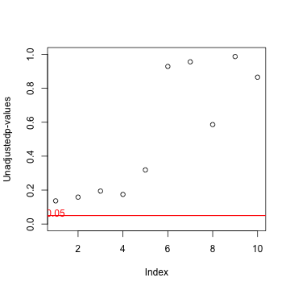
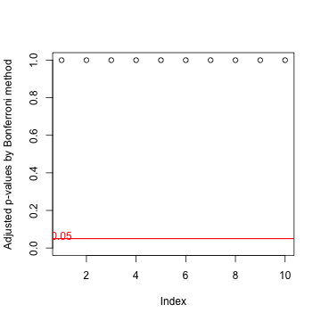

## What is multiplicity?

* Multiplicity occurs when performing several statistical inferences
simultaneously. (e.g. high dimensional screening studies)
* We usually set a significance level at 0.05.
 - which means the acceptable probability to reject a true null hypothesis is 
 0.05 or less.
* However, when we conduct multiple statistical tests simultaneously,
the overall type I error rate is higher than our expectations.

---

## For example...

* Suppose that we test 10 hypotheses simultaneously at the significance level
$\alpha = 0.05$.
* Assume that the hypotheses are all true and they are independent.
* Then, the probability to retain all hypotheses is
 - $(0.95)^{10} = 0.599$
* Therefore, the probability to reject at least one true null hypothesis is
 - $1 - 0.599 = 0.401$.
* It is much more higher than 0.05.
* But it may be hard for statistical novices, like me, to understand this fact.
* Simulation using R is helpful to get a clue of such a difficult concept.

---

## Simulating multiplicity


```r
df <- numeric() ## Create an imaginary population
columnnames <- character()
for(i in 1 : 10) {
  variables <- rnorm(100000)
  df <- cbind(df, variables)
  columnnames <- c(columnnames, paste("variable_", i))
}
colnames(df) <- columnnames
sample_id <- sample(1 : 100000, size = 30 * 2) ## Sample 60 cases
group_A <- df[sample_id[1 : 30], ] ## Assign the sampled cases to each group
group_B <- df[sample_id[31 : 60], ]
p_val <- numeric() ## Calculate p-values
for(i in 1 : 10) {
  temp <- t.test(group_A[, i], group_B[, i], var.equal = TRUE)$p.value
  p_val <- c(p_val, temp)
}
p_val_bonferroni <- p.adjust(p_val, method = "bonferroni") ## P-values adjustment
```

--- &twocol

## Plotting results

*** =left

 

*** =right

 

*** =fullwidth

Some p-values are quite close to 0.05 even though two samples are from 
the same population. But adjusted p-values through Bonferroni method show more
conservative results than the unadjusted ones.  
The application I made, [**Multiplicity**]
(http://jaylkim.shinyapps.io/Multiplicity), is designed for the simulation to
visualize the multiple comparisons problem.
